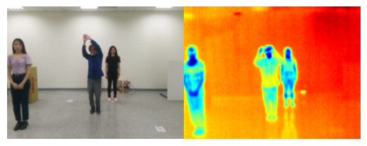
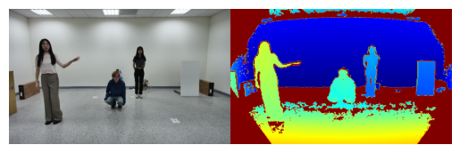

# NYCU x UNCC Dataset

This data collection mainly collects the data of Wi-Fi CSI packets, and at the same time collects a variety of images, including RGB images, depth images and thermal images. And also collects the data of single and multi-person. This library contains the code of these collection methods.

Our collection process is to create a socket server, and multiple sensors are different clients. And we build a GUI on the server, you can set the collection period, the number of collections, and the idle time between each round. Before collecting, server will connect with the client. When starting the collection, server will send a start message to each client, and then send an end message to each client at the end of each round.

## Example
### Thermal

### Depth

