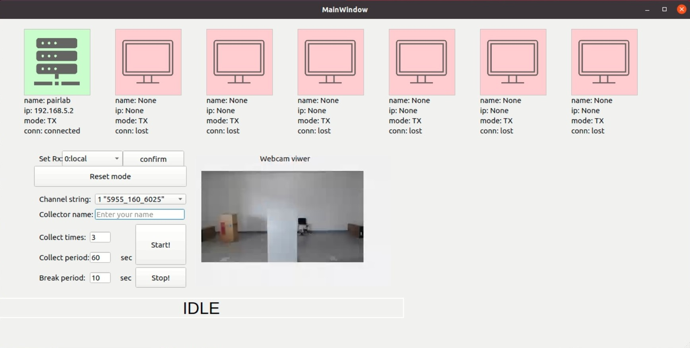

# Data Collection Server

Execute the data collection server and create a GUI to set data collection parameters.
Establish a data collection process, including collection times, collection time, rest time, and record through webcam at the same time.



## Setting Ethernet
Set DHCP on router.
- Router: 192.168.5.1

Set statics ip on server
- Server: 192.168.5.2

## Prerequisite
### Download related package
```shell!
$ pip install -r requirements.txt
```

## Start socket server
### Set NIC ID, bandwidth and channel
> array_prepare_for_picoscenes `NIC ID` "`primary channel` `bandwidth` `center channel`"
```shell!
$ array_prepare_for_picoscenes 6 "6275 160 6345"
```

### Execute collection server
```shell!
$ python3 gui_function.py
```

1. set csi collection client to Rx
2. set channel string, we choose `65 "6275_160_6345"`
3. set collector name, which is data saving path
4. set collect times
5. set collect period
6. set break period

### Start collect
press the `Start!` button, then the server will send a message to all client to start collecting.

After the collecting time which you have already set, server will send a message again to stop the collecting.